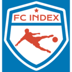
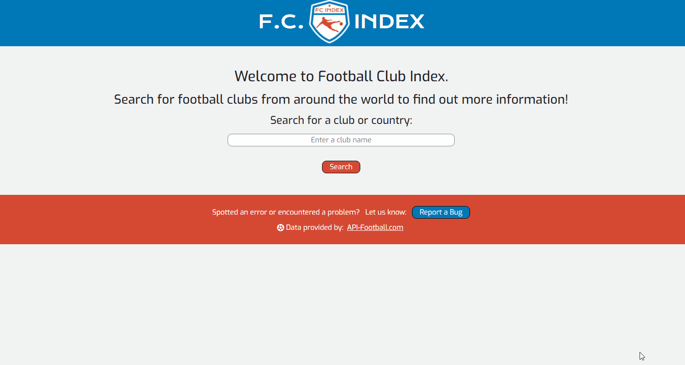
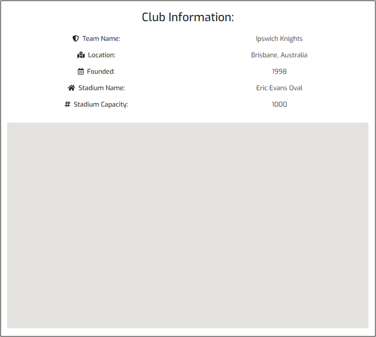

***

# F.C. Index

My project is aimed at football fans; primarily those that are trying to learn more about clubs or those who may be travelling and interested to know if there are any football teams in their place of travel.  FC Index allows users to search for clubs from all over the world and find out information about them as well as see where they are located on Google maps.

The website only has one page with a simple and clean layout.  There is a search box which allows users to search for any club name, city or country.  The website utilises an API to return results of the search string.  Users can then select a club from the selection of clubs returned by the API to find out more information.  The API then provides some high level information on the club which is displayed to the user.  Utilising an API ensures that the data should be maintained and kept up to date.

If the football API returns the club stadium or club city and country, using the Google Maps API utilising the Places API feature, the website searches for the location of the clubs stadium.  If no stadium name is provided, the clubs city is searched for.  If the Places API returns a search result, the location of the club is displayed on a Map.

I have included a form which allows users to report a bug.  Bugs can be related to the use of the website or incorrect club data.

 ***

## UX
 
I used [Coolors](https://coolors.co/) to generate some color schemes and settled on the orange and blue palette.  The logo was designed using [designevo.com](https://www.designevo.com/logo-maker/) and utilises the same colour palette.  I utilised shadow effects on the club information card to add some depth to the site.  I also used a shadow effect when hovering over buttons to give them some depth and interactivity as well.

The purpose of this site is to allow users to search for football clubs.  The search field and button are front and center with little else on the page to distract from that, in a similar way to the [Google](https://www.google.com/) homepage.

### User Stories

The website is for football fans wanting to find out more information on clubs, possibly if they are travelling to a new destination.  As a user:
- I want to search for football clubs and find out more information about them.
- I am travelling to a new destination and want to know if there are any football clubs in the city and/or country I am visiting.
- I want the information I am provided with to be up to date.
- I want a way to report any incorrect information I see so that it can be corrected.

As the owner of the website:
- I want users to be able to quickly search for football clubs and find out information about them.
- I want to utilise an API to provide up to date information to my users.
- I want to utilise an API to provide a map showing the clubs location.
- I want users to be able to notify me if any of the information the website displays is incorrect so that it can be fixed.

### Wireframes

[Click here to see my full Wireframe](wireframe/ms2-project-wireframe.pdf)

***

## Features
 
### Existing Features

- [Football API](https://www.api-football.com/):  The API allows for clubs to be searched.  It requires a string of at least 3 characters and returns an array of results.  Each result contains some high level information about the club.  This is the basis of my website - the user enters a string and when they click the Search button or press Enter, the API is called.  The club name, country and badge are displayed in the results section.  They can then click on a club to view the high level information and view their location on a map.  Users can search for a country and any clubs in that country are also returned by the API.  The footballAPI.js file contains the javascript functions which call and unpack the data in the API.  The user receives a warning on screen if the string they are searching for is less than 3 characters as this is the minimum string length required by the API.
- Pagination:  Occasionally a large amount of data can be returned by the API.  When a user searches for a club or city, the API will return any clubs which contains that string.  Most of the time the API will only return a handful of results.  However, if a user searches for a country, dozens of results are returned.  It would slow the response time if all of these needed to be output onto the screen so I added a pagination feature whereby a maximum of 10 results are displayed on screen at any given time.  If there are more results to cycle through, Next and Previous buttons are displayed as appropriate.   Text appears between the buttons showing the user how many pages of results there are and which page they are currently on - this was a small addition late on in the project to improve user experience.  The Next and Previous button event listeners are in the events.js file while the function that populates the page with the next batch of results (resultsOutput) is located in the footballAPI.js file.
- [Google Maps Javascript API](https://developers.google.com/maps/documentation/javascript/overview?_ga=2.246367876.1606386993.1604865013-774398906.1604748970) & [Google Places API](https://developers.google.com/places/web-service/overview):  I have utilized the Google Maps API and enable the Places API.  The places API allows for strings to be searched for and the results to be displayed on the map with markers.  The javascript functions which call the map and markers are in the maps.js file.
- Feedback Form:  The website features a form which can be launched using a button in the footer.  The form allows users to report errors with either the website or club data.  The form launches as a modal over the top of the main website so that users do not lose the information they are looking at by having to navigate to another page.  If the form is submitted successully, the modal content changes to thank the user and an Ok button enables them to return to the main webpage - the form fields are reset.  If the form is not submitted successfully, the modal content informs them and clicking an OK button returns the user to the form with the data they tried to submit still visible.
- [EmailJS API](https://www.emailjs.com/):  When the form is submitted, an email template is populated and sent to my personal email address.  This is done using emailJS.  The function which calls emailJS is in the emailJS.js file.

Below is as example of the website.  You can see:
1. the warning message the user receives when the search string is less than 3 characters.
2. the list of results including pagination buttons.
3. the club information that is displayed to users including a map with marker.
4. the Back to Results button.
5. the New Search button.
6. the message a user receives if there are no results.

Below an example of a successful form submission and the message the user sees:

Below an example of an unsuccessful form submission and the message the user sees:

### Features Left to Implement

One of the big limitations I came up against as I was developing my project is that the football API only allows 100 calls/day before overage charges are incurred.  Each search on the website performs one call to the API.  The club information returned by the API is fairly high level.  When the user clicks on a club, I use the high level information that has already been returned in the call triggered by the search.  If I wanted to include more information about the club, more calls would need to be made to the API.  When a user clicks on a club, I know the id of the club the user is interested in so I could use this to query the API for a lot more data.

If the free call limit was higher, there are many more features I could have added to my project.  The API has a wide range of data available including club stats, player stats, results, fixtures, betting odds and even predictions on who will win fixtures.  If I could make more free calls to the API, I would have made a call to the API to return the competitions (leagues and cups) each club participates in.  I would also have added the recent results of a club and their upcoming fixtures in the club information section.  The latter would be particularly useful to users who are travelling to a destination as they could search for a club in their destination and then be able to check if there is a fixture taking place during their visit.

A future implementation would be to allow users to search by location and see the results on a map rather than as a list.  I would make the results output optional so that a user can choose to see results as a list or on a map.  For example, if a users searches for a country, seeing the results on a map with markers showing the location of each club returned by the API may be more beneficial.  This would also help users visually see which clubs might be closest to where they staying during their visit.  However, if a user searches for Ipswich, the result returns a club in England and another club in Australia, so seeing these results on a map would not be useful.

The API searches for club names so if a user searches for London, clubs based in London (Chelsea for example) will not be returned by the API.  Another future development might be to use the Google Maps Places API to first search for football clubs in a location e.g. football clubs in London.  The results returned by the Google Maps Places API could potentially be used to search the football API for more information about that club.

***

## Technologies Used

I used the following languages, frameworks and libraries to build this website:
- [HTML5](https://en.wikipedia.org/wiki/HTML5) - HTML5 has been used to code the content of the website.
- [CSS3](https://en.wikipedia.org/wiki/Cascading_Style_Sheets) - CSS3 has been used to style the content.
- [Javascript](https://en.wikipedia.org/wiki/JavaScript) - JavaScript has been used to add interactivity to the site through calling API's and utilising the data returned by them.
- [Bootstrap](https://getbootstrap.com/) - Bootstrap was used to quickly build the website, place content where desired and add margins and padding.
- [FontAwesome](https://fontawesome.com/) - FontAwesome was used to insert icons into the webpage.  One appears in the Footer and others appear in the Club Info section.
- [Google Fonts](https://fonts.google.com/) - Google Fonts have been used to style the text in the website.  The title in the Header has Krona One font which matches the font used in the logo.  All other content has Exo font.
- [FavIcon](https://www.favicon-generator.org/) - This webpage was used to create the small favicon which appears in the webpage tab.  I used the football club logo which appears in the header.

***

## Testing

In this section, you need to convince the assessor that you have conducted enough testing to legitimately believe that the site works well. Essentially, in this part you will want to go over all of your user stories from the UX section and ensure that they all work as intended, with the project providing an easy and straightforward way for the users to achieve their goals.

Whenever it is feasible, prefer to automate your tests, and if you've done so, provide a brief explanation of your approach, link to the test file(s) and explain how to run them.

For any scenarios that have not been automated, test the user stories manually and provide as much detail as is relevant. A particularly useful form for describing your testing process is via scenarios, such as:

1. Contact form:
    1. Go to the "Contact Us" page
    2. Try to submit the empty form and verify that an error message about the required fields appears
    3. Try to submit the form with an invalid email address and verify that a relevant error message appears
    4. Try to submit the form with all inputs valid and verify that a success message appears.

In addition, you should mention in this section how your project looks and works on different browsers and screen sizes.

You should also mention in this section any interesting bugs or problems you discovered during your testing, even if you haven't addressed them yet.

If this section grows too long, you may want to split it off into a separate file and link to it from here.

Below are a number of the tests that I performed on my website:
1.  I have run all of my code through validation tools to ensure there are no errors.  The HTML has been validated through [this tool](https://validator.w3.org/nu/#textarea), the CSS through [this website](https://jigsaw.w3.org/css-validator/) and the JavaScript through [JSHint](https://jshint.com/).
2.  During testing, I noticed that there were some clubs which did not show a result on the map in the club info section e.g. Eric Evans Oval Stadium, Brisbane, Australia for club Ipswich Knights - see below.  The reason was that the createMap function contains an if statement which checks for the results from the Google Maps Places API and then centres the map around the first result (result[0]) and calls the createMarker function to create a marker there.  However, if no results are returned, result[0] doesn't exist and the map has nothing to centre around and nowhere to place a marker.  The reason for this is because there is no if else defined.  I resovled this so that the map is hidden if there is no result.

3.  I have tried inputting various strings into the search field to test that it handles anything a user may inadvertantly search for.  Any strings that are less than 4 characters long do not even call the API due the first if statement in the clubSearch function.  This keyup event listener ensures that users are told that the string must be 4 characters long.  I tried inputting strings containing non-alphabetic characters such as numbers and punctuation characters.  The API does not return results and the second if statement in the clubSearch function ensures that when no results are returned, the user is informed and asked to try changing their search string.  I also tried searching for an HTML string and JavaScript and the result is the same.  Only search strings 4 characters or longer result in the API being called and when it is, if the website handles scenarios when the API returns no results.  I am happy that the search function works as expected.
4.  There is only one link on my webpage.  It appears in the footer and links to the [Football API website](https://www.api-football.com/).  I have tested this and the link opens the webpage in a new window.

### Development Obstacles

Below are some of the hurdles I came up against whilst developing my project.

1. When the search results are output, I unpack some of the club information into a table.  Each row of the table represents a result from the API from the users search.  In order to populate the club-info section with the correct information, I wanted to create an click event listener to each table row which called a function to populate the club-info section and pass the correct club in as a parameter.  I initally created a simple event listener function for the table rows and passed through the index i representing the position in the array of each club.  This didn't work because each event listener returned the club information for the final club in the results array.  The reason being is that i is incremented in the for loop as the table rows are created thus when the event listener on the table rows was triggered, i represented the final result in the results array.  To overcome this, I turned to Google and eventually found [this solution](http://www.howtocreate.co.uk/referencedvariables.html).  The site offers 3 solutions but rates the final one as the "most complete" which is the one I utilised.  I copied the code and modified it in my footballAPI.js (rows 133-150) file to achieve the desired result.
2. The table of search results has a hover effect to highlight each row blue.  Initially I targetted table rows with my CSS hover rule.  Since the table utilises a Bootstrap class table-striped, alternate rows have shading inherited from this class and this meant that initially, my css hover effect was only applied to the table rows without any Bootstrap shading (the even numbered rows).  To overcome this, I initially used the !important override in my CSS rule as an easy solution.  Knowing that this is bad practice, I instead used the Chrome Inspect tools to identify the Bootstrap rule which was being applied (.table-striped tbody tr:nth-of-type(odd)) and changed my rule to target the elements with the same level of specificity (.table-striped tbody tr:hover) knowing that my CSS link is placed after the Bootstrap link in my <head> element and would thus 'win' and apply my hover rule to all table rows.
3. I wanted to add pagination to my search results in order to limit the amount of data displayed on screen.  If a user searches for a country, hundreds of results can be returned.  Not only does this slow the website down because it takes a while to unpack so much data, it also elongates the page and does not create a good user experience.  The results from this API have built in pagination but each page contains 100 results.  I wanted to achieve a far more bitesize number of results and deemed that 10 results are easy to visually digest for a user.  The user does not need to do much scrolling when using a mobile phone.  In order to create pagination for 10 results at a time, I utilised the local storage memory.  Upon searching for a club, the array that is returned by the API is saved to local storage as “clubs”.  I also have an index number (i) which I set to zero whenever a search is performed and save it in the local storage.  The index number determines where in the array the user is.  The reason I saved it to local storage is so it can be retrieved by independent “next” and “previous” functions which are triggered by buttons and move the index forward or backwards through the array.  The index is reset to zero after each search.  The resultsOutput function is called when a new search is done and when the previous or next buttons are clicked.  This function retrieves the API results array from local storage as well as the index i.  Using i, the data is unpacked from the API using a for loop.  The results are displayed on screen, starting from our position i and going up to the upper limit which will be 10 or less.  The findLimit function is called which determines whether there are a further 10 results in the array; if so i+10 is returned as the upper limit, otherwise the remaining length of the array is returned as the upper limit.  The resultsOutput function then also checks whether there is an array result 10 further on from the current position (i+10) and if so, displays the “next” button on screen.  If there is an array result 10 before our current position (i-10), the “previous” button is displayed on screen.  I also pass the clubs array and position i into the resultsLinks function.  The next and previous pagination buttons both call similar functions.  Each retrieves the value of i from local storage.  The next button function increases i by 10 and the previous button function decreases i by 10 - i is then saved (updated) in local storage.  The resultsOutput function is then called.

### Unresolved Bugs/Issues

The football API returns a directory for the club badge image.  I use this to display the club badge in the search results table, club info section and in the information shown by clicking on the map markers.  This adds some visual elements to the webpage.  However, for many clubs there is no badge image and the image below is returned by the API.  I had hoped that in each instance where no club badge was provided, the same directory would be returned by the API.  If it was, I would have been able to build an 'if' statement into the JavaScript to check all the club badge directory strings returned by the API.  For example, if the directory string returned for a club matches the "image not available" directory string I would then choose not to use the image.  I would either hide the elements containing the club badge or perhaps use a more visually pleasing, colourful placeholder image, for example the FC Index logo.  Unfortunately, the API returns a unique directory for every club, regardless of whether a club badge is available or not.  Due to this, my webpage presents the below image for quite a lot of clubs.  If a user searches for "Manchester" the API returns 13 clubs, 8 of which have no club badge and thus the below image is returned but from 8 different directories.

***

## Deployment

The project was developed in its entirety using GitPod with every update being pushed to the main branch.  The main branch is hosted on GitHub pages [here](https://lukegarnham.github.io/FC-Index-MS2/).

***

## Credits

### Media
- The only media content used is the club logo which I created using [this website](https://www.designevo.com/logo-maker/).

### Acknowledgements

- For the modal, I utilised a solution provided [here](https://www.w3schools.com/howto/howto_css_modals.asp).  This solution has been modified for the purposes of my website but I predominently used the CSS styling to create the shaded background which sits on top of the main webpage content.
- The favicons were generated using [this website](https://www.favicon-generator.org/).
- The football API was sourced through [rapidAPI.com](https://rapidapi.com/api-sports/api/api-football/details) and the documentation for the API can be found [here](https://www.api-football.com/documentation#leagues-parameters).  The initial API call code was copied from [here](https://rapidapi.com/api-sports/api/api-football/endpoints) but modified for the purposes of my website.
- [EmailJS](https://www.emailjs.com/) has been used so that reports submitted by users on the website are emailed to my personal email address utilising an email template.
- [Google Maps JavaScript API](https://developers.google.com/maps/documentation/javascript/overview) has been used to provide the maps in the club info section.  In conjunction with this, [Google Maps Places API](https://developers.google.com/places/web-service/overview) has been used so that the club locations can be searched for and markers added to the map at the location of the first result.  The functions which calls the map and places the marker were copied from [here](https://developers.google.com/maps/documentation/javascript/examples/place-search?hl=en_GB#maps_place_search-javascript) but have been modified for the purposes of my website.
- When the search results are generated, I need each to have an onclick event which passes the relevant club information into the club info section.  To create this, I utilised [this solution](http://www.howtocreate.co.uk/referencedvariables.html) I found through a Google search.  This can be found in the resultsLinks function in the footballAPI.js file.
- The error type provided through the emailJS was originally formatted with underscores and was all in lower case.  Although a minor cosmetic tweak, I wanted this to be formatted with spaces instead of underscores and the first letter of each word to be capitalised so that the emails received looked neater/more presentable.  I utilised [this solution](https://masteringjs.io/tutorials/fundamentals/capitalize-first-letter#:~:text=Capitalizing%20the%20first%20letter%20of,the%20string%20slice()%20method.&text=The%20first%20part%20converts%20the,the%20rest%20of%20the%20string) I found via Google which can be found in the dataValidation.js file.
