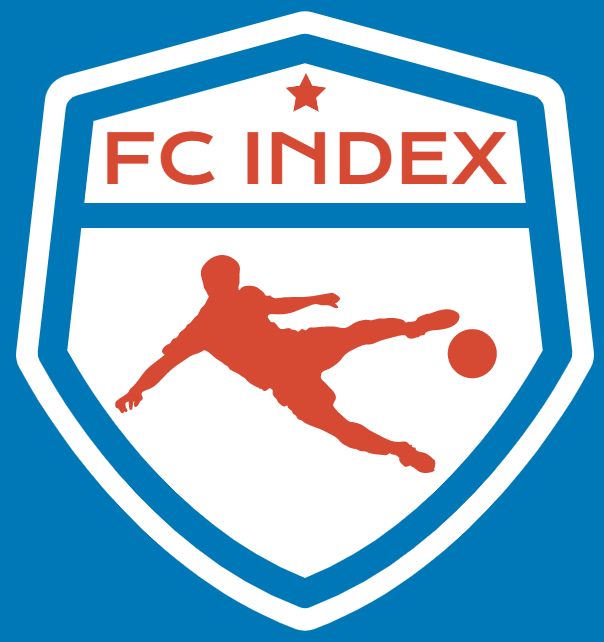

***

# F.C. Index

My project is aimed at football fans.  FC Index allows users to search for clubs from all over the world and find out information about them.

The website only has one page with a simple and clean layout.  There is a search box which allows users to search for any club name.  The website utilises an API to return results of the search string.  Users can then select the club they wish to find out more information.  The API then provides some high level information on the club which is displayed to the user.  Utilising an API ensures that the data should be maintained and kept up to date.  However, I have included a form which allows users to report a bug.  Bugs can be related to the use of the website or incorrect club data.
 
 ***

## UX
 
I used [Coolors](https://coolors.co/) to generate some color schemes and settled on the orange and blue palette.  The logo was designed using [designevo.com](https://www.designevo.com/logo-maker/) and utilises the same colour palette.  I utilised shadown effects on the club information card to add some depth to the site.  I also used a shadow effect when hovering over buttons to give them some depth as well.

The purpose of this site is to allow users to search for football clubs.  The search field and button are front and center with little else on the page to distract from that, in a similar way to the [Google](https://www.google.com/) homepage.

### User Stories

The website is for football fans wanting to find out more information on clubs.  As a user:
- I want to search for football clubs and find out more information about them.
- I want the information I am provided with to be up to date.
- I want a way to report any incorrect information I see so that it can be corrected.

As the owner of the website:
- I want users to be able to quickly search for football clubs and find out information about them.
- I want to utilise an API to provide updated information to my users.
- I want users to be able to notify me if any of the information the website displays is incorrect so that it can be fixed.

### wireframes

[Click here to see my full Wireframe](wireframe/ms2-project-wireframe-update.pdf)

This section is also where you would share links to any wireframes, mockups, diagrams etc. that you created as part of the design process. These files should themselves either be included as a pdf file in the project itself (in an separate directory), or just hosted elsewhere online and can be in any format that is viewable inside the browser.

## Features

In this section, you should go over the different parts of your project, and describe each in a sentence or so.
 
### Existing Features
- Feature 1 - allows users X to achieve Y, by having them fill out Z
- ...

For some/all of your features, you may choose to reference the specific project files that implement them, although this is entirely optional.

In addition, you may also use this section to discuss plans for additional features to be implemented in the future:

### Features Left to Implement
- Another feature idea

## Technologies Used

In this section, you should mention all of the languages, frameworks, libraries, and any other tools that you have used to construct this project. For each, provide its name, a link to its official site and a short sentence of why it was used.

- [JQuery](https://jquery.com)
    - The project uses **JQuery** to simplify DOM manipulation.

## Testing

In this section, you need to convince the assessor that you have conducted enough testing to legitimately believe that the site works well. Essentially, in this part you will want to go over all of your user stories from the UX section and ensure that they all work as intended, with the project providing an easy and straightforward way for the users to achieve their goals.

Whenever it is feasible, prefer to automate your tests, and if you've done so, provide a brief explanation of your approach, link to the test file(s) and explain how to run them.

For any scenarios that have not been automated, test the user stories manually and provide as much detail as is relevant. A particularly useful form for describing your testing process is via scenarios, such as:

1. Contact form:
    1. Go to the "Contact Us" page
    2. Try to submit the empty form and verify that an error message about the required fields appears
    3. Try to submit the form with an invalid email address and verify that a relevant error message appears
    4. Try to submit the form with all inputs valid and verify that a success message appears.

In addition, you should mention in this section how your project looks and works on different browsers and screen sizes.

You should also mention in this section any interesting bugs or problems you discovered during your testing, even if you haven't addressed them yet.

If this section grows too long, you may want to split it off into a separate file and link to it from here.

## Deployment

This section should describe the process you went through to deploy the project to a hosting platform (e.g. GitHub Pages or Heroku).

In particular, you should provide all details of the differences between the deployed version and the development version, if any, including:
- Different values for environment variables (Heroku Config Vars)?
- Different configuration files?
- Separate git branch?

In addition, if it is not obvious, you should also describe how to run your code locally.

## Credits

### Content
- The text for section Y was copied from the [Wikipedia article Z](https://en.wikipedia.org/wiki/Z)

### Media
- The photos used in this site were obtained from ...

### Acknowledgements

- I received inspiration for this project from X